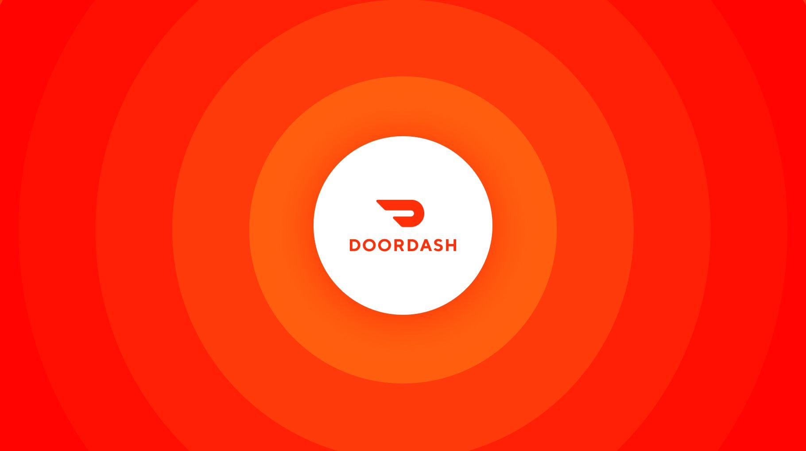
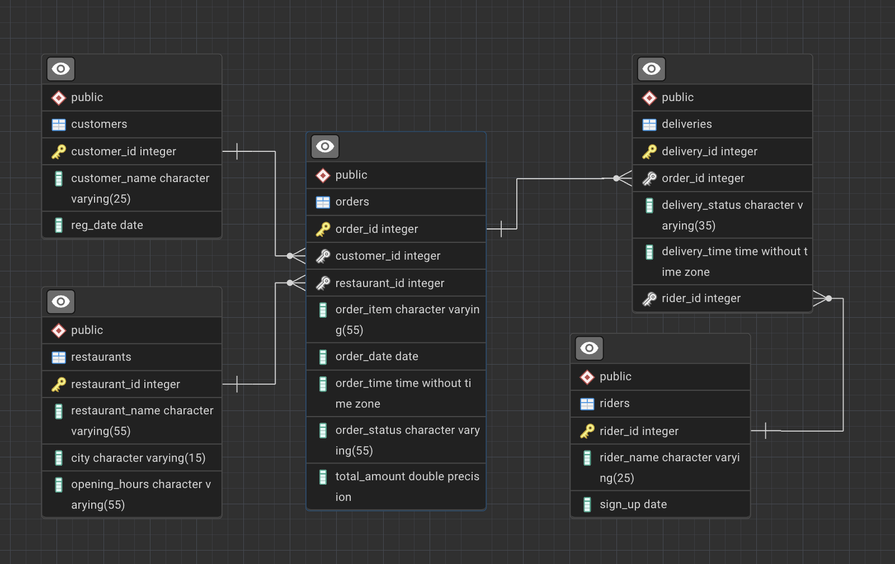

# 🍽️ DoorDash Data Analysis Using SQL


This project demonstrates how to create a basic SQL database schema for a mock DoorDash system. The database consists of tables to store customer, restaurant, order, rider, and delivery information. The data is inserted into the tables, and various queries are run to gain insights into customer behavior, restaurant performance, and delivery statistics.

## 🚀 Project Overview

The main focus of this project is:
- 🛠️ Creating a relational database schema for a food delivery system.
- 📊 Populating the database with sample data.
- 🔍 Running SQL queries to analyze various aspects of customer orders, restaurant performance, and delivery efficiency.

## 🗂️ Database Schema



The database consists of the following tables:

1. **Customers**: Stores information about customers registered with the platform.
2. **Restaurants**: Contains details about restaurants partnered with DoorDash.
3. **Orders**: Holds data on food orders placed by customers.
4. **Riders**: Captures information about delivery riders.
5. **Deliveries**: Tracks the status and timing of deliveries.

### 🛠️ Table Structure

1. **Customers Table**
   - `customer_id` (Primary Key)
   - `customer_name`
   - `reg_date` (Registration Date)

2. **Restaurants Table**
   - `restaurant_id` (Primary Key)
   - `restaurant_name`
   - `city`
   - `opening_hours`

3. **Orders Table**
   - `order_id` (Primary Key)
   - `customer_id` (Foreign Key references `customers`)
   - `restaurant_id` (Foreign Key references `restaurants`)
   - `order_item`
   - `order_date`
   - `order_time`
   - `order_status`
   - `total_amount`

4. **Riders Table**
   - `rider_id` (Primary Key)
   - `rider_name`
   - `sign_up` (Rider's registration date)

5. **Deliveries Table**
   - `delivery_id` (Primary Key)
   - `order_id` (Foreign Key references `orders`)
   - `delivery_status`
   - `delivery_time`
   - `rider_id` (Foreign Key references `riders`)

## 📊 Sample Data

The project includes pre-populated sample data for customers, restaurants, orders, riders, and deliveries to simulate a real-world scenario. The sample data is inserted directly into the database tables, and each row represents a unique entry for the respective entity.

## 💡 Example Queries

Here are some useful SQL queries you can run on the data to gain insights:

1. **🍔 Top 3 most frequently ordered dishes by customer**
   ```sql
   WITH RankedDishes AS (
    SELECT 
        c.customer_id,
        c.customer_name,
        o.order_item AS dish,
        COUNT(*) AS order_count,
        DENSE_RANK() OVER (PARTITION BY c.customer_id ORDER BY COUNT(*) DESC) AS rank
    FROM orders o
    JOIN customers c ON o.customer_id = c.customer_id
    WHERE o.order_date >= CURRENT_DATE - INTERVAL '1 year'
      AND c.customer_name = 'Daniel Brown'
    GROUP BY c.customer_id, c.customer_name, o.order_item)
    SELECT 
        customer_id, 
        customer_name, 
        dish AS dishes, 
        order_count
    FROM RankedDishes
    WHERE rank <= 3
    ORDER BY order_count DESC;

2. **🧑‍💻 Popular Time Slots**
   ```sql
   WITH TimeSlots AS (
    SELECT
        FLOOR(EXTRACT(HOUR FROM order_time) / 2) * 2 AS start_hour,
        FLOOR(EXTRACT(HOUR FROM order_time) / 2) * 2 + 2 AS end_hour,
        COUNT(*) AS order_count
    FROM orders
    GROUP BY start_hour, end_hour)
    SELECT
        CONCAT(start_hour, ' - ', end_hour) AS time_slot,
        order_count
    FROM TimeSlots
    ORDER BY order_count DESC;

3. **⏳ Average Delivery Time**
   ```sql
   SELECT 
    r.rider_id, 
    r.rider_name,
    ROUND(AVG(EXTRACT(EPOCH FROM (
        d.delivery_time - o.order_time 
        + CASE 
            WHEN d.delivery_time < o.order_time THEN INTERVAL '1 day'
            ELSE INTERVAL '0 day'
          END
    )) / 60), 2) AS avg_delivery_time_minutes
    FROM deliveries d
    JOIN orders o ON d.order_id = o.order_id
    JOIN riders r ON d.rider_id = r.rider_id
    WHERE o.order_status = 'Delivered'
    GROUP BY r.rider_id, r.rider_name
    ORDER BY avg_delivery_time_minutes;

Similarly 10 more advanced queries to analyse on this datasets.

## 🛠️ Requirements
- A local SQL database (e.g., MySQL, PostgreSQL) or cloud-based SQL service.
- SQL client (e.g., MySQL Workbench, pgAdmin, or command-line SQL tools).
- Basic knowledge of SQL queries and relational database management.

## ⚙️ Setup Instructions
1. **Create Database Schema:**
   - Run the provided SQL scripts to create the tables (`customers`, `restaurants`, `orders`, `riders`, and `deliveries`).

2. **Insert Sample Data:**
   - Use the `INSERT` statements provided in the script to populate the tables with sample data.

3. **Run SQL Queries:**
   - Execute the queries to analyze the data for business insights, such as identifying customer preferences, restaurant performance, and delivery efficiency.


## 🌟 Future Enhancements
- Implement advanced SQL queries for deeper analysis.
- Add more features like rating systems for restaurants and riders.
- Introduce triggers or stored procedures for automation.
- Add support for NoSQL database integration for unstructured data.

## 🤝 Conclusion
This project provides a basic foundation for understanding SQL database management in a food delivery platform context. It demonstrates the power of relational databases in managing real-world scenarios like customer orders, restaurant operations, and delivery trac
